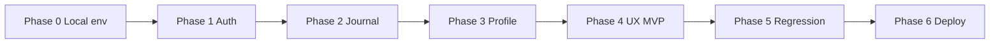

# Reflectly / MimoSe — MVP Local Plan

> **Mục tiêu:** Ổn định **MVP trụ cột** chạy tốt trên **local** trước khi deploy production.  
> **Chiến lược:** Code & verify local → checklist pass → mới deploy (phase cuối).  
> **Dùng doc này** khi mở chat mới: copy link file hoặc nói *"implement theo MVP_LOCAL_PLAN.md"*.

**Repos:**
- Backend: `reflectly-be` — Spring Boot 3.5, Java 21, PostgreSQL
- Frontend: `reflectly-fe` — React 19, Vite 7, MUI

**Nhánh làm việc:** `develop` (code mới nhất). Chỉ merge `main` sau khi MVP local pass.

---

## 1. Định nghĩa MVP (trụ cột ổn định)

MVP = người dùng có thể **đăng ký / đăng nhập → viết journal → xem/sửa/xóa → quản lý profile → logout**, không crash, không mất data trong session.

### Trong scope MVP

| Trụ cột | User story | BE | FE |
|---------|------------|----|----|
| **Auth** | Signup, login username/password, logout | `POST /api/auth/signup`, `/login` | `LoginPage`, `SignupPage`, `AuthProvider` |
| **Auth (optional)** | Login Google | `POST /api/auth/google` + Google secrets | `LoginPage` + `@react-oauth/google` |
| **Journal** | Tạo entry (title, reflection, emotions) | `POST /api/entries` | `NewEntryPage` |
| **Journal** | Danh sách + pagination | `GET /api/entries` | `EntriesListPage` |
| **Journal** | Sửa / xóa entry | `PUT/DELETE /api/entries/{id}` | `EditEntryPage` |
| **Profile** | Xem & đổi tên | `GET/PUT /api/users/profile` | `ProfilePage` |
| **Profile** | Đổi password | `PUT /api/users/password` | `ProfilePage` |
| **Profile** | Upload avatar | `POST /api/users/avatar` | `ProfilePage` |
| **Session** | Refresh trang vẫn đăng nhập | JWT + profile rehydrate | `AuthProvider`, `axiosSetup` |
| **Navigation** | Route bảo vệ, redirect login | Security filters | `ProtectedRoute`, `AppRoutes` |

### Ngoài scope MVP (defer)

| Feature | Lý do |
|---------|--------|
| Statistics page | Chỉ stub `<h1>Statistics</h1>` |
| Quotes page | Chỉ stub |
| Energy / Orbit / Factors (PRD cũ) | Chưa có BE entity/API |
| Marketing pages polish | Innerverse, Outerverse, Mimo Method — giữ nhưng không block MVP |
| Entry filter API (date/emotion query params) | FE có `getEntriesByDateRange` nhưng BE controller chưa wire — list page filter **client-side** đủ cho MVP |
| Avatar cloud storage | Local filesystem OK cho MVP local |
| Deploy production | **Sau** khi MVP local pass |

---

## 2. Trạng thái hiện tại (baseline)

### Đã có / gần xong

- Auth code flow Google (authCode) — BE + FE đã migrate
- Entries CRUD end-to-end (code có đủ)
- Profile page đầy đủ UI (name, password, avatar, stats từ entries)
- React Query + axios interceptors
- Vitest tests (auth, login, signup, axios) — 97 tests pass
- `.env.example` + README cập nhật

### Chưa ổn / cần fix trong MVP

| Vấn đề | Chi tiết |
|--------|----------|
| BE `.env` thiếu Google | Chưa có `GOOGLE_CLIENT_ID`, `GOOGLE_CLIENT_SECRET` → Google login local fail |
| Local stack chưa verify E2E | User gặp `ERR_CONNECTION_REFUSED` khi chưa `npm run dev` |
| FE `.env` port API | Đã sửa về `8080`; cần confirm mỗi lần chạy |
| Statistics / Quotes | Route tồn tại nhưng empty — **ẩn khỏi nav** hoặc redirect trong MVP |
| MobileFooter nested button | Warning hydration trong test — polish nhỏ |
| BE không có automated tests | Manual checklist bắt buộc |

---

## 3. Lộ trình implement (theo phase)



---

### Phase 0 — Local environment ổn định

**Mục tiêu:** Dev mở máy là chạy được trong 5 phút.

#### Tasks

- [ ] **0.1** Hoàn thiện `reflectly-be/.env` (copy từ `.env.example`):

```env
DB_URL=<neon hoặc docker local>
DB_USERNAME=...
DB_PASSWORD=...
JWT_SECRET=<>=32 chars>
GOOGLE_CLIENT_ID=<same as FE>
GOOGLE_CLIENT_SECRET=<from Google Console>
SPRING_PROFILES_ACTIVE=local
APP_CORS_ALLOWED_ORIGINS=http://localhost:5173,http://localhost:8080
```

- [ ] **0.2** Hoàn thiện `reflectly-fe/.env`:

```env
VITE_API_URL=http://localhost:8080/api
VITE_GOOGLE_CLIENT_ID=<same as BE>
```

- [ ] **0.3** Google Cloud Console — OAuth Web client:
  - Authorized JavaScript origins: `http://localhost:5173`
  - (Không cần redirect URI cho auth-code + `postmessage`)

- [ ] **0.4** Script chạy local (ghi vào README hoặc `package.json` root script nếu muốn):

```powershell
# Terminal 1 — BE
cd reflectly-be
mvn spring-boot:run

# Terminal 2 — FE
cd reflectly-fe
npm run dev
```

- [ ] **0.5** Verify endpoints:
  - http://localhost:8080/swagger-ui.html
  - http://localhost:8080/actuator/health → `UP`
  - http://localhost:5173 → landing load

**Acceptance:** BE health OK, FE load, không `ERR_CONNECTION_REFUSED`.

---

### Phase 1 — Auth trụ cột

**Mục tiêu:** Signup → login → refresh → logout hoạt động ổn.

#### Tasks

- [ ] **1.1** Test **credential signup**: `/signup` → redirect `/home` hoặc entries
- [ ] **1.2** Test **credential login**: `/login` → JWT trong `localStorage` key `auth_token`
- [ ] **1.3** Test **session persist**: F5 trang `/entries/list` → vẫn authenticated
- [ ] **1.4** Test **401 handling**: xóa token thủ công → redirect `/login`
- [ ] **1.5** Test **Google login** (nếu secrets có): auth code → backend JWT
- [ ] **1.6** Fix bugs nếu có (ghi issue + file path trong checklist cuối doc)

#### Files chính

| Layer | Path |
|-------|------|
| BE | `AuthController.java`, `AuthService.java`, `UserService.java` |
| FE | `AuthProvider.tsx`, `authService.ts`, `authQueryHook.ts`, `axiosSetup.ts` |
| FE | `LoginPage.tsx`, `SignupPage.tsx`, `ProtectedRoute.tsx` |

**Acceptance:**

```
[ ] Signup user mới thành công
[ ] Login user cũ thành công
[ ] Logout xóa session
[ ] F5 không bị đá về login (khi còn token hợp lệ)
[ ] Google login (optional): pass hoặc documented skip
```

---

### Phase 2 — Journal (core value)

**Mục tiêu:** CRUD entry là flow chính sau login.

#### Tasks

- [ ] **2.1** **Create:** `/entries/new` — title, reflection, emotions → save → thấy trong list
- [ ] **2.2** **List:** `/entries/list` — pagination (load more), empty state khi chưa có entry
- [ ] **2.3** **Read:** click entry → edit page load đúng data
- [ ] **2.4** **Update:** sửa title/reflection/emotions → save → list cập nhật
- [ ] **2.5** **Delete:** xóa entry → biến mất khỏi list
- [ ] **2.6** Client-side filters (today/week/month/search) — verify không crash với 0 entries
- [ ] **2.7** (Optional) Wire BE date/emotion query params nếu client-side filter không đủ — **chỉ khi cần**

#### Files chính

| Layer | Path |
|-------|------|
| BE | `EntryController.java`, `EntryService.java`, `EntryEntity.java` |
| FE | `entriesService.ts`, `entriesQueryHook.ts` |
| FE | `NewEntryPage`, `EditEntryPage`, `EntriesListPage`, `EntryCard`, `EmotionCapture` |

**Acceptance:**

```
[ ] Tạo ≥3 entries với emotions khác nhau
[ ] Sửa 1 entry — data persist sau F5
[ ] Xóa 1 entry — không còn trong list
[ ] Pagination: tạo >5 entries — load more hoạt động
[ ] Không có console error đỏ khi CRUD
```

---

### Phase 3 — Profile trụ cột

**Mục tiêu:** User quản lý identity cơ bản.

#### Tasks

- [ ] **3.1** Xem profile — tên, avatar, email hiển thị đúng
- [ ] **3.2** Đổi display name → persist sau F5
- [ ] **3.3** Đổi password → login lại bằng password mới
- [ ] **3.4** Upload avatar → hiển thị (local: `uploads/avatars/` trên BE)
- [ ] **3.5** Stats trên profile (streak, top mood) — verify với entries thật hoặc hiển thị empty gracefully

#### Files chính

| Layer | Path |
|-------|------|
| BE | `UserController.java`, `UserService.java` |
| FE | `userService.ts`, `ProfilePage.tsx`, `statsUtil.ts` |

**Acceptance:**

```
[ ] Đổi tên thành công
[ ] Đổi password + re-login thành công
[ ] Upload avatar hiển thị (cùng origin BE để load ảnh)
[ ] Logout từ profile hoạt động
```

---

### Phase 4 — UX MVP (polish tối thiểu)

**Mục tiêu:** App dùng được hàng ngày, không gây hiểu nhầm.

#### Tasks

- [ ] **4.1** **Ẩn hoặc disable** nav tới `/statistics` và `/quotes` (stub pages) — hoặc hiện "Coming soon" có chủ đích
- [ ] **4.2** Default route sau login: `/entries/list` hoặc `/home` — thống nhất một chỗ
- [ ] **4.3** Mobile footer: fix nested `<button>` trong FAB (accessibility)
- [ ] **4.4** Error messages user-friendly (login fail, entry save fail, 网络)
- [ ] **4.5** Loading states — không flash blank khi `ProtectedRoute` rehydrate
- [ ] **4.6** i18n: EN default; VI không broken trên MVP screens
- [ ] **4.7** Breadcrumb / back navigation trên entry flows

**Acceptance:**

```
[ ] User mới biết đi đâu sau login (không bị lost)
[ ] Không click vào trang trống từ main nav
[ ] Mobile width 375px — usable (manual check)
```

---

### Phase 5 — Regression & quality gate

**Mục tiêu:** MVP đủ tin cậy để gọi là "stable local".

#### Automated

```powershell
cd reflectly-fe
npx vitest run

cd reflectly-be
./mvnw.cmd clean compile
```

#### Manual E2E script (chạy 1 lần trước khi deploy)

| # | Steps | Expected |
|---|-------|----------|
| 1 | Signup `mvp_user_01` | Account created, logged in |
| 2 | Create entry "Day 1" + emotions | In list |
| 3 | Edit entry → "Day 1 updated" | Saved |
| 4 | Profile → change name | Visible after refresh |
| 5 | Logout | Redirect login |
| 6 | Login again | Entries still there |
| 7 | Delete entry | Gone |
| 8 | Close browser → reopen `/entries/list` | Still logged in (if token valid) |

#### Bug log template (điền khi test)

```markdown
### Bug: [title]
- Phase:
- Steps:
- Expected:
- Actual:
- Files:
- Fixed: [ ]
```

**MVP GATE:** Tất cả manual steps pass + `vitest run` pass + BE compile pass.

---

### Phase 6 — Deploy (sau MVP local)

> **Chỉ bắt đầu phase này khi Phase 5 pass.**

Tham chiếu: `.github/SECRETS_SETUP.md`, `README.md` deploy sections.

#### Checklist deploy

- [ ] GitHub secrets đầy đủ (BE: JWT, Google, DB, CORS; FE: VITE_API_URL)
- [ ] `APP_CORS_ALLOWED_ORIGINS` = `https://gray-island-018b47d00.3.azurestaticapps.net`
- [ ] PR `develop` → `main` (hoặc merge nếu đã sync)
- [ ] Re-run Azure BE workflow → `/actuator/health` = UP
- [ ] Smoke test production URL
- [ ] Branch protection on `main` (optional)

---

## 4. Kiến trúc tham chiếu nhanh

```
Browser (localhost:5173)
    → axios (Bearer JWT)
    → Spring Boot (localhost:8080/api)
    → PostgreSQL (Neon hoặc docker-compose)
```

**Auth flow:** Google authCode hoặc credentials → backend JWT → `localStorage.auth_token`

**API thật (chỉ tin các endpoint này):**

```
POST   /api/auth/google | /login | /signup
GET    /api/users/profile
PUT    /api/users/profile | /password
POST   /api/users/avatar
GET    /api/entries?page&size
GET    /api/entries/{id}
POST   /api/entries
PUT    /api/entries/{id}
DELETE /api/entries/{id}
```

---

## 5. Quy ước khi implement (chat mới)

1. **Branch:** `develop` — commit nhỏ, message rõ (`fix:`, `feat:`, `test:`)
2. **Scope:** Chỉ sửa file liên quan phase hiện tại — không refactor lan man
3. **Verify:** Sau mỗi phase chạy acceptance checklist của phase đó
4. **Không deploy** cho đến Phase 6
5. **Docs cũ** (`documentation/02-API-Specs/Endpoints.md`, energy/orbit) — **bỏ qua**
6. **Source of truth:** `services/` (FE), `controller/` (BE), Swagger local

### Prompt gợi ý cho chat mới

```
Implement Reflectly MVP local theo documentation/MVP_LOCAL_PLAN.md.
Bắt đầu Phase [0/1/2/...].
Repos: reflectly-be + reflectly-fe, branch develop.
Sau mỗi phase: chạy test + báo acceptance checklist.
Không deploy production.
```

---

## 6. Ưu tiên fix nếu bị kẹt

| Triệu chứng | Nguyên nhân thường gặp | Fix |
|-------------|------------------------|-----|
| `ERR_CONNECTION_REFUSED` :5173 | FE dev server chưa chạy | `npm run dev` |
| API network error | BE chưa chạy hoặc sai port | `mvn spring-boot:run`, check `VITE_API_URL` |
| Google login fail | Thiếu secrets BE/FE hoặc origins | Google Console + `.env` |
| 401 sau login | JWT không gửi / hết hạn | `axiosSetup.ts`, token storage |
| Avatar không hiện | URL ảnh trỏ sai host | BE serve `/uploads/**`, check `pictureUrl` |
| Entry không load | DB connection | Check `DB_*` trong BE `.env` |

---

## 7. Definition of Done — MVP Local

MVP được coi là **xong** khi:

- [ ] Phase 0–5 acceptance checklists **tất cả ticked**
- [ ] `npx vitest run` — pass
- [ ] Manual E2E script (Phase 5) — pass
- [ ] Không có bug **blocker** mở trong bug log
- [ ] User có thể dùng app local hàng ngày (journal + profile) ít nhất 30 phút không crash

Sau đó → chuyển sang **Phase 6 Deploy** hoặc chat mới với prompt deploy.

---

*Last updated: 2026-07-05 — reflectly-be/documentation/MVP_LOCAL_PLAN.md*
